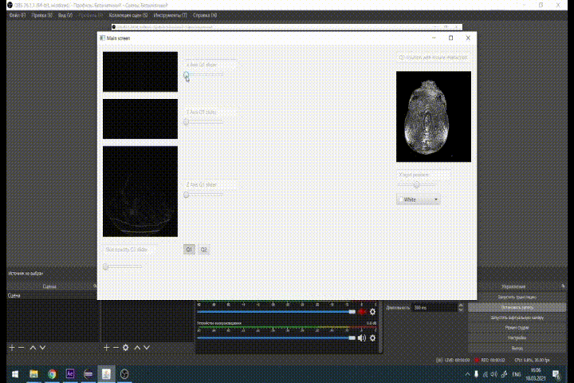
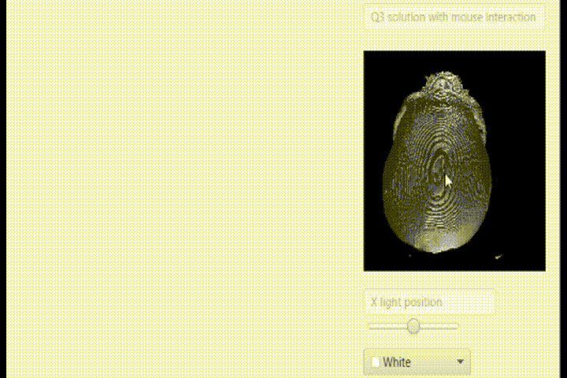

Coursework project with volume data set (the one in the showcase is not provided because of copyright).
I've implemented ray rendering, arc rotation using rotation matrix and matrix multiplication.
Also implemented rendering using light rendering such as ambient, diffuse and specular light.

The data set are taken from:
https://www.cg.tuwien.ac.at/research/vis/datasets/

